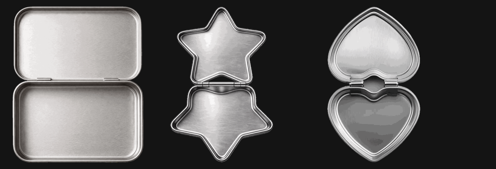
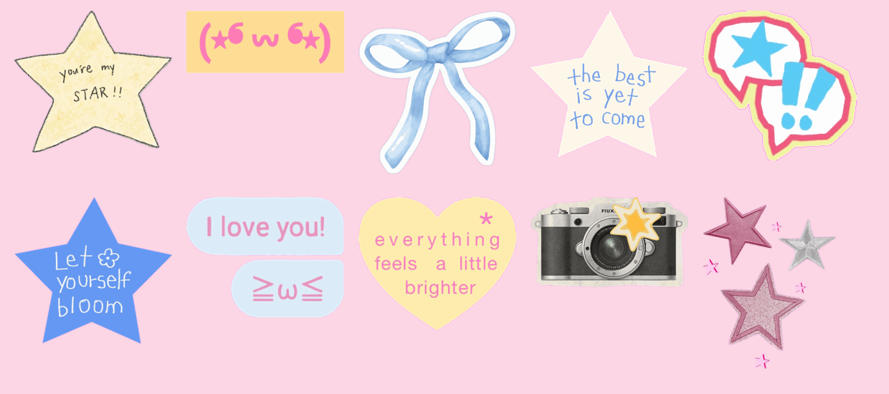
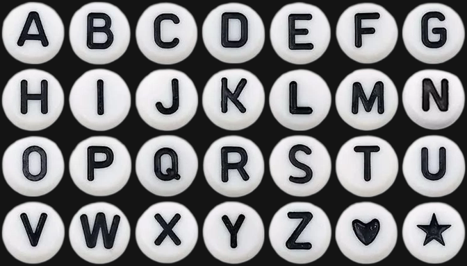

# 铁盒贴 · Tincase 🫙✨

> 复古 Y2K 风格的「铁皮盒贴贴」互动小应用 —— 选一个铁盒，把贴纸、拼豆和小物件贴满它。

一个纯前端的 H5 互动小工具：模拟老式桌面窗口的复古界面，用户可以挑选不同形状的铁皮盒（心形 / 星形 / 长方形），用贴纸、拼豆（perler beads）、小物件和相机装饰自己的铁盒，并一键保存为图片分享。

A pure front-end H5 interactive toy: pick a tin shape, decorate it with Y2K-style stickers, perler beads and trinkets, then export your creation as an image.

## ✨ 功能特性 / Features

- 🫙 **三种铁盒形状** — 心形、星形、长方形铁盒自由切换
- 🎀 **丰富装饰素材** — 20+ 款贴纸（蝴蝶结、徽章、拍立得、CD、耳机等）、26 字母拼豆块、3 款复古相机
- 🖱️ **自由拖拽摆放** — 基于 Pointer Events，支持鼠标与触屏、双指缩放
- ↩️ **撤销 / 清空 / 删除选中** — 完整的编辑操作
- 💾 **一键导出图片** — Canvas 渲染，保存即可分享
- 🖥️ **复古桌面窗口风** — 标题栏、菜单栏、仿 Win98 交互的 Y2K 美学

## 🛠️ 技术栈 / Tech Stack

| 模块 | 说明 |
|------|------|
| 渲染 | 原生 Canvas 2D，`toDataURL` 图片导出 |
| 交互 | Pointer Events（统一鼠标 / 触摸），触屏手势适配 |
| 框架 | **零依赖** 原生 JavaScript + CSS，开箱即用 |

## 📁 目录结构 / Structure

```
├── ee8addec/
│   ├── dist/               # 可直接部署的成品应用
│   │   ├── index.html      # 入口页面
│   │   └── assets/         # JS / CSS / 全部美术素材（贴纸、铁盒、背景、图标）
│   ├── icon/               # 应用图标（48px ~ 1024px，两版设计）
│   ├── vibe_images/        # 视觉设计源图
│   ├── extract_*.py        # 素材提取 / 背景处理脚本（Python）
│   ├── tincase-tieba.zip   # 打包发布件
│   └── *_preview.png       # 素材预览图
```

## 🚀 快速开始 / Quick Start

无需构建，直接打开即可运行：

```bash
# 方式一：本地直接打开
open ee8addec/dist/index.html

# 方式二：起一个静态服务器（推荐，体验最佳）
cd ee8addec/dist
python -m http.server 8080
# 浏览器访问 http://localhost:8080
```

## 🖼️ 预览 / Preview

| 铁盒 | 贴纸 | 拼豆 |
|:---:|:---:|:---:|
|  |  |  |

---

Made with 🫙 & ✨ · Y2K Forever
